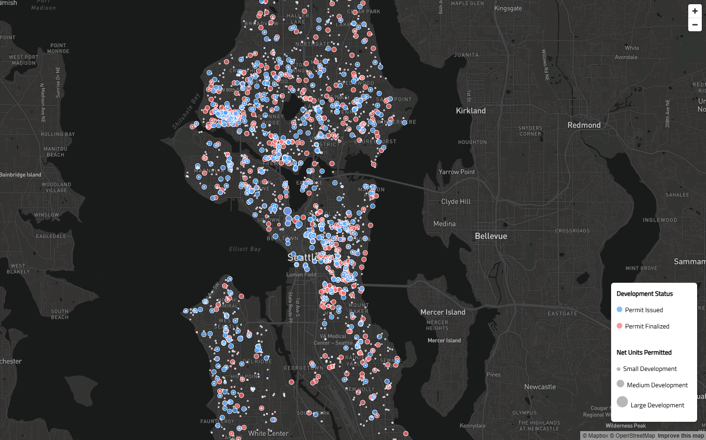
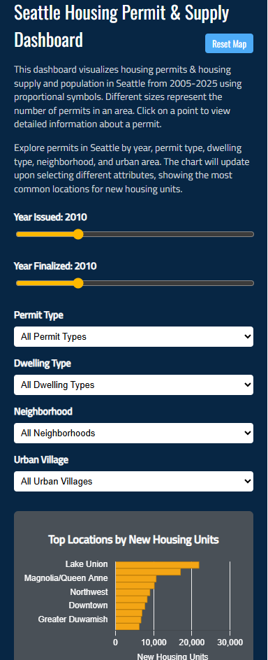
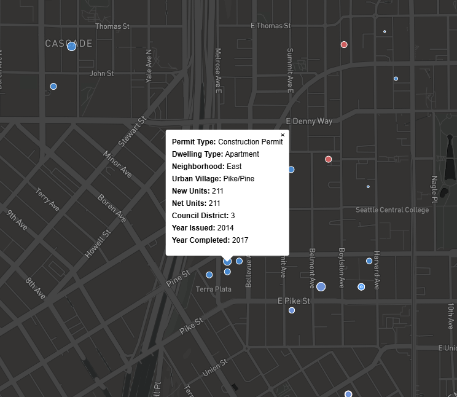

# Seattle Housing Permit Supply & Population Map Dashboard

**_Created by_** Travis Lee, Kevin Chao, and Kaitlyn Billington

## URLs
https://tralee10.github.io/SEA_Housing_Map/index.html

## Project Overview
This project aims to provide insight into how effectively housing development responds to demographic changes. By visualizing these relationships spatially, users can better understand where housing supply may be keeping up with demand and where gaps may exist. The broader impact includes improving transparency in housing development patterns and potentially informing city planners, policymakers, researchers, and residents.

### Key Objectives
- Increase public awareness of traffic hazards.
- Help city planners make data-driven urban planning decisions.
- Enable drivers and commuters to navigate more safely.

### Target Audience
- **Seattle City Planners**: utilizing the map for informed decision-making when planning future developments.
- **Housing Policy Researchers**: assessessing the data to understand housing trends in reference to population data.
- **Students & General Public**: exploring the map for personal or educational purposes, getting a better idea of what is going on within different communities.

## Features & Functionality
**Time-Based Sliders**
> - The **Year Issued** slider alters which points are shown on the map based on the year in which the building permit was issued. 
> - The **Year Finished** slider alters which points are shown on the map based on the year in which the building was completed.

**Dropdown Menus**
> - The **Permit Type** dropdown filters the data being viewed at one time based on the type of permit they have, either construction or demolition.
> - The **Dwelling Type** dropdown filters the data being viewed at one time based on the type of dwelling being built. This includes things like "Detached Single-Family", "Apartment", "Accessory Dwelling, Attached", etc.
> - The **Neighborhood** dropdown filters the data being viewed at one time based on the neighborhood that the permits are set in. In Seattle, this includes places like "Northeast", "Northwest", and "Ballard".
> - The **Urban Village** dropdown filters the data being viewed at one time based on the urban village that the permits are set in. In Seattle, this includes places like "University District Northwest", "Roosevelt", and "Capitol Hill".

**Dynamic Bar Chart**
> - The dynamic bar chart shows the most common locations for new housing units.
> - Chart updates based on the **Year**, **Permit Type**, **Dwelling Type**, **Neighborhood**, and/or **Urban Village** that is selected.


## Screenshots
#### The following images illustrate the key features of the Seattle Housing Permit Supply & Population Map Dashboard:

### Proportional Symbols Map


### Functions Bar (Time Slider, Dropdown Menus, Dynamic Bar Chart)


### Pop-Up Details



## Data
### Sources
[**Built Units Since 2010**](https://data-seattlecitygis.opendata.arcgis.com/datasets/SeattleCityGIS::built-units-since-2010/about): Records from the City of Seattle. Includes building permits assigned for creating or demolishing housing units from 2010-2020. This dataset came from the the _Seattle GeoData Portal_ and was cleaned to create our [```built_units.csv```](assets/built_units.csv) and [```built_units.geojson```](assets/built_units.geojson) files located in the assets folder.

[**Annual Population and Housing Estimates for 2020 Census Blocks in Seattle**](https://data-seattlecitygis.opendata.arcgis.com/datasets/SeattleCityGIS::annual-population-and-housing-estimates-for-2020-census-blocks-in-seattle/about): Population estimates  from the Small Area Estimates Program (SAEP), generated by the Washington State Office of Financial Management. The data includes population and housing data by census block. This dataset came from the the _Seattle GeoData Portal_ and was cleaned to create our [```2020_population.csv```](assets/2020_population.csv) and [```2020_population.geojson```](assets/2020_population.geojson) files located in the assets folder.

## Applied Libraries and Web Services
- **JavaScript, HTML, CSS**: Provides the structure and styling for the web application.
- **Mapbox GL JS**: Handles rendering of the interactive map and geospatial visualizations.
- **GeoJSON** - Used for storing and displaying spatial data.
- **Chart.js**: Used to display statistical charts in dashboard.
- **github**: Used to publish webpage.

## Acknowledgements

### Inspirations & References
This project is inspired by:
- **US Hospital Facility Bed Capacity Map** by CovidCareMap [View Web Page](https://www.covidcaremap.org/maps/us-healthcare-system-capacity/#3.5/38/-96) 
- **Mapping Neighborhoods with the Highest Risk of Housing Instability and Homelessness** by Urban Institute [View Web Page](https://www.urban.org/data-tools/mapping-neighborhoods-highest-risk-housing-instability-and-homelessness)

### Imagery

Sourced from **Visit Seattle Washington** [View Image Source](https://visitseattle.org)

### AI Acknowledgement
_ChatGPT was used to create the [```favicon.png```](img/map_favicon.png) and to help debug code._
